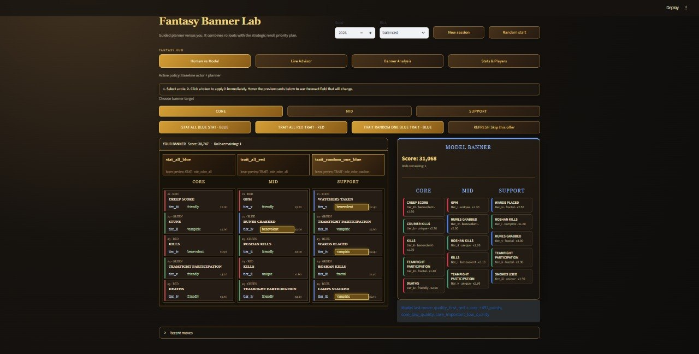
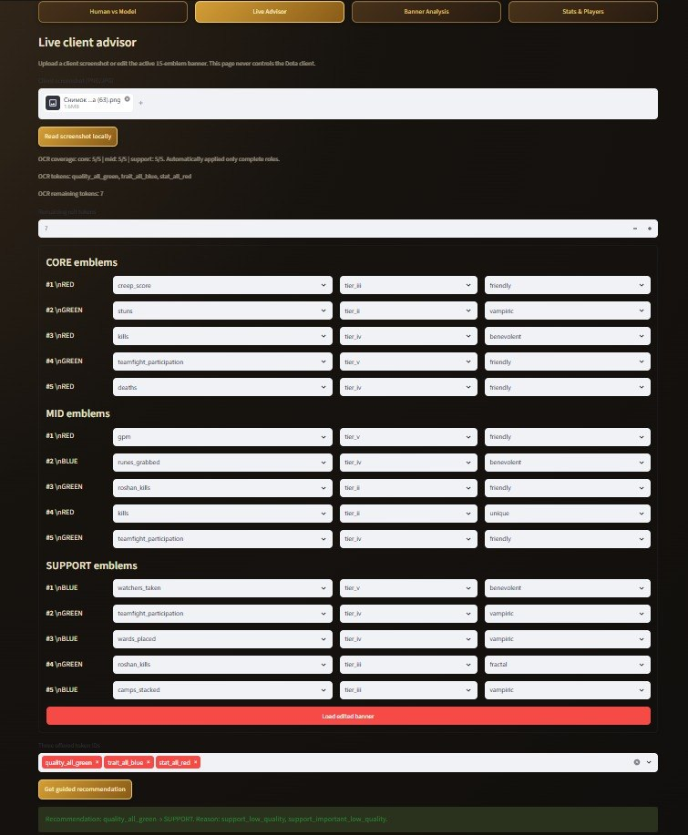
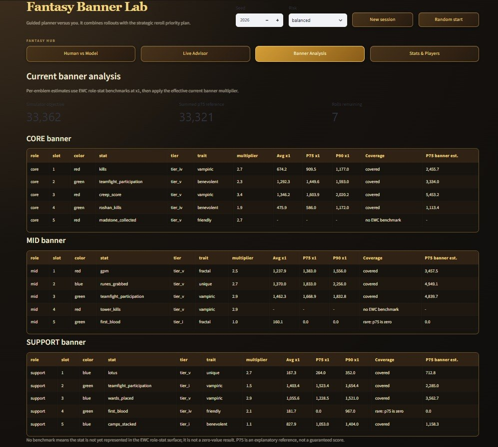
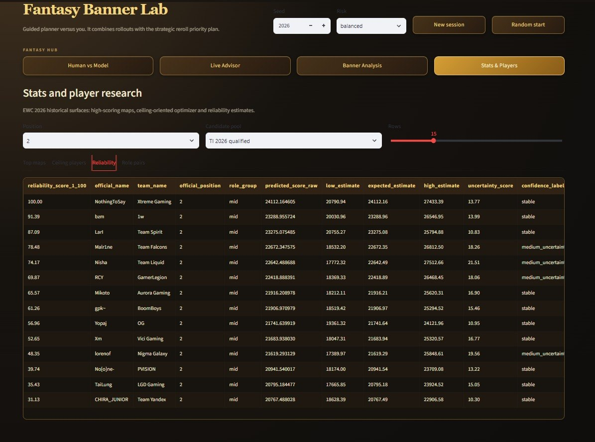
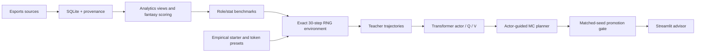

# Dota 2 Fantasy Analytics & Decision System

**Python · PyTorch · Transformers · Reinforcement Learning · Monte Carlo Planning · SQLite · Streamlit**

An end-to-end research software project for tournament fantasy analytics and
sequential Dota Fantasy banner optimization. It combines reproducible esports
data pipelines with a rule-faithful simulator, Transformer actor-critic, and
actor-guided Monte Carlo planning.

The project separates real tournament data from synthetic decision trajectories.
Training metrics never promote a model by themselves: every candidate requires
an independent paired evaluation on matched seeds.

## At a glance

| Area | Current scope |
|---|---|
| Tournament analytics | 157 EWC 2026 maps, player-map fantasy statistics, role aggregation, provenance and coverage tracking |
| Sequential optimizer | Exact 30-step simulator, three token offers plus refresh, masked variable action space |
| Active decision system | Validated baseline Transformer actor plus bounded Monte Carlo planner |
| Promotion protocol | Matched schedules, paired deltas, bootstrap confidence intervals, safe/balanced/ceiling scenarios |

## Key results

### Tournament analytics

- **157 EWC 2026 maps** are available in the local compact database.
- The data layer supports player-map, role-slot, stage, source-coverage, and
  per-stat fantasy analysis.
- The fact agent uses a source-first SQL route for database-backed facts.

### RNG optimization

- The active system is **baseline actor + exact Monte Carlo planner**.
- A conservative actor-critic candidate was **rejected** after an independent
  safe-scenario regression, despite acceptable training metrics.
- Historical generated reports were intentionally pruned. Do not publish stale
  candidate deltas: generate a fresh matched result via
  [docs/RESULTS.md](docs/RESULTS.md).

## Product surfaces

The Streamlit **Fantasy Hub** exposes the research system through four focused
workflows rather than one monolithic screen.

| Human vs Model | Live Advisor |
|---|---|
|  |  |
| Shared-offer 30-step simulation against the planner. | Screenshot OCR, manual correction, token entry, and a guided move. |

| Banner Analysis | Stats & Players |
|---|---|
|  |  |
| Per-emblem multiplier and role-stat benchmark diagnostics. | Historical fantasy maps, ceiling rankings, reliability, and role pairs. |

## System architecture



See [Research architecture](docs/RESEARCH_ARCHITECTURE.md) for tensor
representation, PPO, offline RL, planner design, and evaluation methodology.

## Quickstart: portable demo

The demo needs no tournament database, model artifact, API token, or OCR.

```powershell
python -m venv .venv
.\.venv\Scripts\python.exe -m pip install -U pip
.\.venv\Scripts\python.exe -m pip install -r requirements.txt
.\.venv\Scripts\python.exe scripts\run_demo.py
.\.venv\Scripts\python.exe -m streamlit run examples\demo_app.py
```

`scripts/build_demo_db.py` creates an ignored deterministic SQLite database at
`data/sample/demo.sqlite`. The demo is synthetic and exists solely to make a
clean clone reviewable.

## Full local setup

The full advisor needs ignored local artifacts:

```text
data/ewc_2026_fantasy_compact.sqlite
data/ti_2026_fantasy_compact.sqlite
models/rng_neural_slot_selfplay_selected_v1.pt
```

Then run `run_rng_human_vs_model_ui.cmd`. For screenshot OCR, run
`run_rng_ui_ocr_setup.cmd` and install system Tesseract.

## Reproducible evaluation

```powershell
.\.venv\Scripts\python.exe scripts\run_portfolio_evaluation.py `
  --candidate models\candidate.pt --episodes 100
```

The generated report is ignored by Git. Record only candidates that pass the
promotion gate in [docs/RESULTS.md](docs/RESULTS.md).

## Repository layout

```text
app/        Streamlit advisor and dashboards
configs/    tournament metadata, RNG presets, title rules
data/       ignored local artifacts plus portable demo builder
docs/       methodology, architecture, results protocol
examples/   self-contained demo
notebooks/  collection and fact-agent workflows
scripts/    supported collection, validation, and training CLI
src/        data, scoring, simulator, planner, and ML implementation
tests/      deterministic rule and smoke tests
```

## Documentation

- [Data and SQLite](docs/DATA_AND_DATABASE.md)
- [Analytics and fact-agent](docs/ANALYTICS_AND_AGENT.md)
- [Research architecture](docs/RESEARCH_ARCHITECTURE.md)
- [RNG actor-critic and planner](docs/RNG_ACTOR_CRITIC.md)
- [Results and evaluation protocol](docs/RESULTS.md)
- [Reproducibility](docs/REPRODUCIBILITY.md)

## Research questions

1. Which player and role combinations offer robust fantasy upside rather than a
   single-map outlier?
2. Can a rule-faithful simulator improve sequential banner decisions under
   stochastic token offers?
3. Does an actor-guided planner outperform its baseline under matched random
   schedules?

Training loss is diagnostic. Independent paired evaluation is the decision
criterion.
