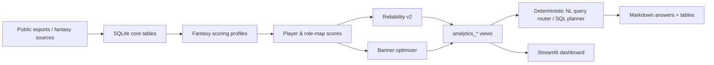

# Dota 2 Fantasy Analytics — EWC 2026

An end-to-end analytics project for **Esports World Cup 2026 Dota 2 fantasy data**. The repository combines a structured SQLite analytics layer, fantasy scoring profiles, reliability estimates, banner optimization, source provenance, deterministic natural-language query routing, and a Streamlit dashboard.


## What is inside

The included database currently contains:

- **157** EWC 2026 maps and **1,570** player-map fantasy rows;
- **120** player identity records;
- **14** public `analytics_*` SQLite views;
- player- and role-slot reliability outputs with temporal backtesting records;
- banner/profile scoring tables and optimizer recommendations;
- a source registry with provenance for tournament, roster, hero, fantasy-stat, and TI 2026 qualification data.

The project is designed around a **source-first** approach: external facts are stored with provenance, while analytical queries are answered from the structured database whenever possible.

## Architecture



More detail: [`docs/ARCHITECTURE.md`](docs/ARCHITECTURE.md).

## Repository structure

```text
fantasy-analytics/
├── data/
│   └── ewc_2026_fantasy_compact.sqlite
├── src/
│   ├── ewc_fact_agent_tools.py
│   ├── fantasy_banner_optimizer.py
│   └── fantasy_profile_constructor.py
├── dashboard/
│   └── app.py
├── notebooks/
│   └── ewc2026_fact_agent_demo.ipynb
├── tests/
│   └── regression_tests.py
├── scripts/
│   └── validate_project.py
├── docs/
│   ├── ARCHITECTURE.md
│   ├── MODELING.md
│   ├── DATA_SOURCES.md
│   └── DATABASE_GUIDE.md
├── requirements.txt
└── README.md
```

## Quick start

Requires **Python 3.10+**.

```bash
python -m venv .venv
```

Activate the environment, then install the runtime dependencies:

```bash
pip install -r requirements.txt
```

Run the full project validation:

```bash
python scripts/validate_project.py
```

Run only the regression checks:

```bash
python tests/regression_tests.py
```

Launch the dashboard:

```bash
streamlit run dashboard/app.py
```

The dashboard reads the bundled SQLite database from `data/`.

## Query interface

The main analytical interface lives in `src/ewc_fact_agent_tools.py`. It maps common natural-language requests to known analytics views and parameterized SQL routes.

Example:

```python
from pathlib import Path
import sys

sys.path.insert(0, str(Path("src").resolve()))
from ewc_fact_agent_tools import ask

result = ask("top 15 fantasy pos1 players from TI 2026 qualified teams", max_rows=5)
print(result.answer_markdown)
```

The core query path is deterministic. Optional GigaChat integration is used only to polish a generated answer when `use_llm=True` and `GIGACHAT_CREDENTIALS` is configured; the structured data and SQL route remain the source of facts.

## Main analytical components

**Fantasy scoring.** Player-map fantasy scores combine base BattlePass-style stat points with bonuses from a selected role-aware banner profile.

**Reliability v2.** The stored reliability layer is aimed at repeatable fantasy upside rather than a simple average. It uses best-series/top-tail features, recent form, spike/volatility penalties, and shrinkage toward role-level behavior.

**Uncertainty.** `low_estimate`, `expected_estimate`, and `high_estimate` are **heuristic uncertainty bands**, not formal statistical confidence intervals or Bayesian credible intervals.

**Banner optimizer.** The optimizer ranks player and role-slot attractiveness for the stored fantasy profile using repeatability, upside, and spike-related features.

**Backtesting.** The database stores group-to-playoffs and temporal evaluation records. These are exposed for inspection rather than hidden behind a single headline metric; several role-specific segments are materially weaker than the aggregate results.

Details and limitations: [`docs/MODELING.md`](docs/MODELING.md).

## Data and provenance

The database source registry records data or cross-checks from sources including Liquipedia, OpenDota, Dotabuff, the BattlePass Fantasy guide, and a secondary Dot Esports TI 2026 participant cross-check.

See [`docs/DATA_SOURCES.md`](docs/DATA_SOURCES.md) for the source roles and caveats recorded by the project.

## Important limitations

- The bundled database contains **157 maps**, while its metadata records an expected Dotabuff count of **159**; the original database therefore marks the build as incomplete with respect to match count.
- Support-player fantasy statistics are recorded as incomplete/low-confidence in the project. Default reliability recommendations focus on positions 1–3 and `core_pair` / `mid_single`.
- The reliability score is a project-specific decision-support score, not a calibrated probability of future performance.
- The heuristic uncertainty bands should not be presented as statistical confidence intervals.
- External source pages can change after the database snapshot was built.

## Documentation

- [`ARCHITECTURE.md`](docs/ARCHITECTURE.md) — system components and data flow.
- [`MODELING.md`](docs/MODELING.md) — scoring, reliability, optimizer, backtesting, and limitations.
- [`DATA_SOURCES.md`](docs/DATA_SOURCES.md) — provenance recorded in the SQLite source registry.
- [`DATABASE_GUIDE.md`](docs/DATABASE_GUIDE.md) — useful analytics views and SQL examples.
- [`notebooks/ewc2026_fact_agent_demo.ipynb`](notebooks/ewc2026_fact_agent_demo.ipynb) — compact interactive demonstration.
