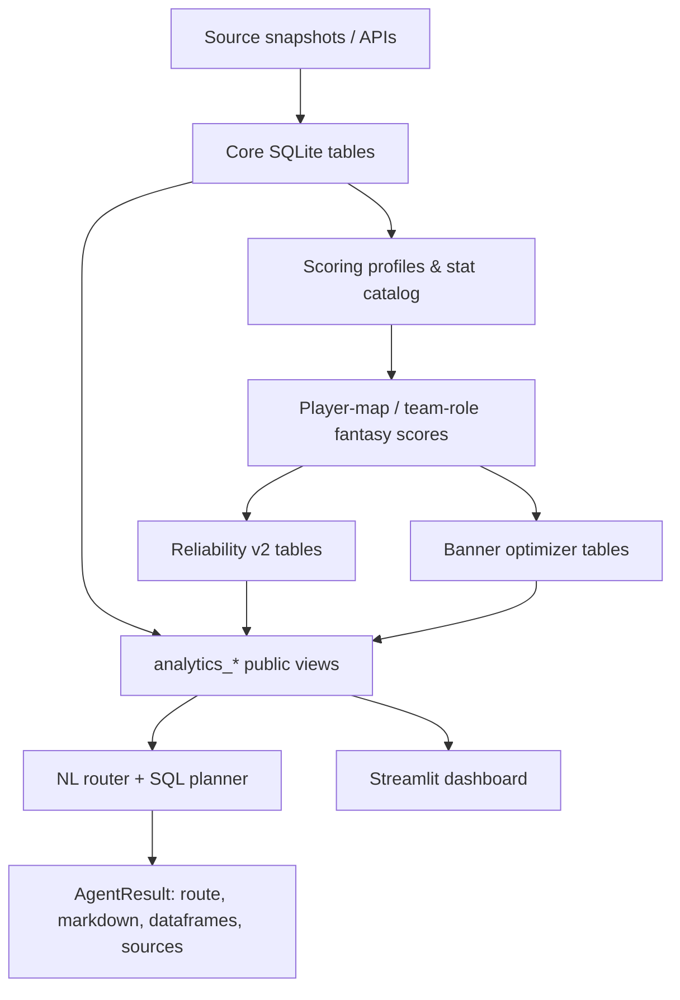

# Architecture

## Design goal

The project separates **stored facts**, **derived analytics**, and **presentation/query interfaces**. The SQLite database is the central source of truth for the public analytical layer.



## 1. Data layer

The bundled `data/ewc_2026_fantasy_compact.sqlite` contains the original project's compact analytical database. It holds tournament/match/player data, fantasy scoring inputs, source provenance, derived predictions, evaluation records, and public views.

The public interface is intentionally centered on views named `analytics_*`, including:

- `analytics_player_maps`
- `analytics_team_role_maps`
- `analytics_reliable_players`
- `analytics_reliable_role_slots`
- `analytics_optimizer_players`
- `analytics_optimizer_role_slots`
- `analytics_rosters`
- `analytics_ti2026_teams`
- `analytics_sources`
- `analytics_scoring_formula`
- `analytics_reliability_backtest`
- `analytics_db_objects`

There are 14 public `analytics_*` views in the bundled database.

## 2. Scoring and profile construction

`src/fantasy_profile_constructor.py` provides role-aware fantasy-profile construction and recalculates profile-specific player-map and role-map scores inside SQLite.

The source logic is preserved from the original Project F. Only the default database location was changed from a machine-specific Windows path to `data/ewc_2026_fantasy_compact.sqlite`.

## 3. Reliability and optimizer layers

`src/fantasy_banner_optimizer.py` builds optimizer recommendations over profile-specific series scores. The database also contains the project's `reliability-v2` prediction and evaluation tables.

See `MODELING.md` for the exact interpretation and limitations used by the project.

## 4. Query layer

`src/ewc_fact_agent_tools.py` provides:

- parsing of position, role, team, player, stage, and result limits;
- deterministic routing from a natural-language question to a known analytical intent;
- SQL-plan construction and inspection;
- direct helper functions for common analytics queries;
- source lookup from the database source cache;
- `EWCFactAgent`, `ask(...)`, and interactive `chat(...)` entry points.

The router is not dependent on an LLM. If explicitly enabled, an optional GigaChat call can polish a draft answer after the structured query has been executed.

## 5. Dashboard

`dashboard/app.py` is a lightweight Streamlit interface over the public SQLite views. It contains filtering for position/role/team/stage and exposes fantasy, reliability, and optimizer outputs.

## 6. Validation

`tests/regression_tests.py` checks database integrity, row-count invariants, formula consistency, support-exclusion rules, public-view count, and the expected deterministic agent routes.

`scripts/validate_project.py` performs a broader end-to-end smoke check and then runs the regression suite.

## Portability changes in this repository

The original Project F used hard-coded machine-specific Windows paths. This repository resolves paths from the repository root:

```text
repo root
├── data/      # SQLite database
├── src/       # core Python modules
├── dashboard/ # Streamlit app
├── tests/     # regression checks
└── scripts/   # validation entry points
```

No scoring constants, stored database outputs, or model formulas were intentionally changed as part of this restructuring.
