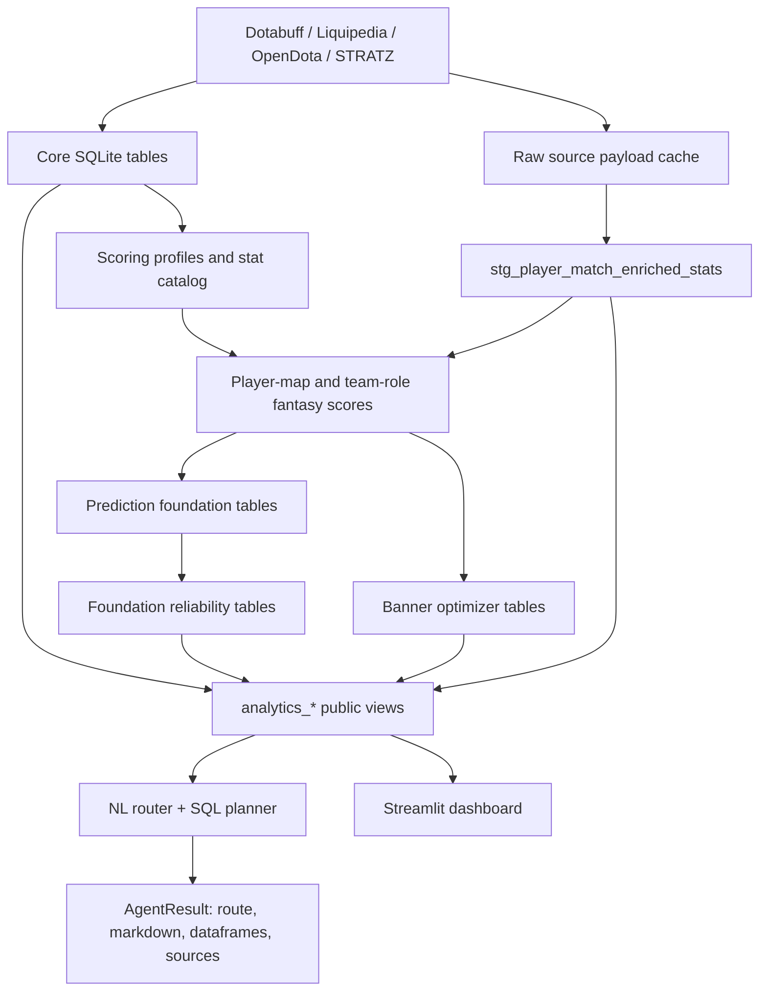

# Architecture

## Design goal

The project separates **stored facts**, **enrichment/backfill**, **derived analytics**, and **presentation/query interfaces**. SQLite is the central source of truth for the public analytical layer.

## 1. Data layer

The locally built database `data/ewc_2026_fantasy_compact.sqlite` contains the compact analytical database. It holds tournament, roster, player-map, fantasy-score, reliability, optimizer, provenance, and evaluation data.

The public interface is intentionally centered on views named `analytics_*`.

Current notable public views:

- `analytics_player_maps`
- `analytics_team_role_maps`
- `analytics_reliable_players_foundation`
- `analytics_reliable_role_slots_foundation`
- `analytics_optimizer_players`
- `analytics_optimizer_role_slots`
- `analytics_rosters`
- `analytics_ti2026_teams`
- `analytics_sources`
- `analytics_scoring_formula`
- `analytics_scoring_titles`
- `analytics_reliability_foundation_backtest`
- `analytics_db_objects`
- `analytics_fantasy_backfill_coverage`
- `analytics_fantasy_backfill_sanity`

The exact count of public `analytics_*` views grows over time as new analytical layers are added; use `analytics_db_objects` as the canonical in-database catalog.

## 2. Core scoring layer

`src/fantasy_profile_constructor.py` provides role-aware fantasy profile construction and recalculates profile-specific player-map and role-map scores inside SQLite.

The current scoring stack is:

1. selected-stat x1 base points for the active banner profile;
2. selected-stat multiplier uplift (`profile_bonus_points`);
3. optional coach-title uplift (`title_bonus_points`) from prefix/suffix rules.

Coach-title rules are stored separately so that client-like comparisons can test banner-only scoring versus banner-plus-title scoring without rebuilding the whole database logic from scratch.

## 3. Enrichment and backfill layer

This is the part that was added to make missing fantasy-stat coverage auditable and reproducible.

Main pieces:

- `src/enrichment/stat_source_map.py`
  Defines source preference, field mapping, and point formulas per fantasy stat.
- `src/enrichment/opendota_backfill.py`
  Handles schema setup, OpenDota payload extraction, staged rows, final stat-point writes, and coverage/sanity views.
- `src/enrichment/stratz_backfill.py`
  Holds the STRATZ preflight and schema-probe scaffold for metrics still not available from OpenDota in this environment.

Important storage objects:

- `raw_match_source_payloads`
- `raw_match_source_status`
- `stg_player_match_enriched_stats`
- `fantasy_stat_backfill_audit`

These let the project distinguish:

1. payload fetched,
2. value extracted,
3. point rows rebuilt,
4. source still missing.

## 4. Reliability and optimizer layers

`src/fantasy_prediction_foundation.py` builds a cleaner evaluation layer over map-level and generic series-level targets. It avoids tying all predictive work to a single hard-coded `best2_series` outcome and stores reusable baseline/evaluation rows in SQLite.

`src/fantasy_banner_optimizer.py` builds optimizer recommendations over profile-specific series scores. The database also contains the newer foundation reliability tables alongside the legacy reliability-v2 layer.

See `docs/MODELING.md` for the interpretation and limitations.

## 5. Query layer

`src/ewc_fact_agent_tools.py` provides:

- parsing of position, role, team, player, stage, and result limits;
- deterministic routing from a natural-language question to a known analytical intent;
- SQL-plan construction and inspection;
- direct helper functions for common analytics queries;
- source lookup from the database source cache;
- `EWCFactAgent`, `ask(...)`, and interactive `chat(...)` entry points.

The router is not dependent on an LLM. If explicitly enabled, an optional GigaChat layer can polish the response after the structured query is complete.

## 6. Dashboard

`dashboard/app.py` is a lightweight Streamlit interface over the public views. It exposes fantasy, reliability, and optimizer outputs with team/role/stage filters.

## 7. Validation

`tests/regression_tests.py` checks:

- database integrity;
- row-count invariants;
- formula consistency;
- support-exclusion rules;
- public-view count;
- deterministic agent routes.

`scripts/validate_project.py` performs a broader smoke check and then runs the regression suite.

## 8. Current source-status interpretation

The architecture now explicitly separates:

- **real zeros**
- **sparse-key zeros**
- **source-missing metrics**

That distinction is surfaced through:

- `analytics_fantasy_backfill_coverage`
- `analytics_fantasy_backfill_sanity`

This is important because some final tables still contain historical zero rows for unsupported metrics. The coverage view, not the raw zero count alone, is the authoritative indicator of whether a stat is actually sourced.

