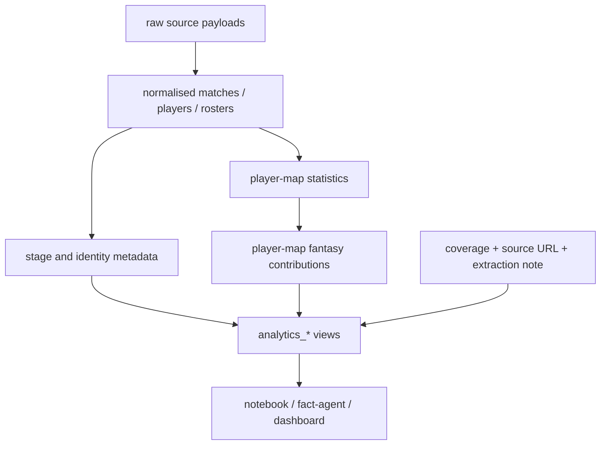

# Данные и SQLite

## Базы

| Событие | Канонический файл | Назначение |
|---|---|---|
| EWC 2026 | `data/ewc_2026_fantasy_compact.sqlite` | Исторический набор для основной аналитики и моделей фэнтези. |
| TI 2026 | `data/ti_2026_fantasy_compact.sqlite` | Текущий турнир, live-анализ и данные для клиентских проверок. |

Не используйте старые теневые копии в `data/db/`. Код и notebooks должны
получать путь через свой конфигурационный блок, а не через жёстко заданный
абсолютный путь.

## Содержимое

База хранит матчи и карты, игроков, команды и составы, реальные роли,
статистику игрока по карте, фэнтези-вклад по каждой метрике, стадии турнира,
источник и статус покрытия.

Для чтения предпочитайте `analytics_*` views. Наиболее полезные:

- `analytics_player_maps` — игрок, карта, команда, роль и итоговый fantasy.
- `analytics_team_role_maps` — агрегаты `core_pair`, `mid_single`,
  `support_pair` по карте.
- `analytics_rosters` — официальный ник, команда и позиция.
- `analytics_metric_definitions` — название метрики, цвет и правила.
- `analytics_fantasy_backfill_coverage` — где значение реально подтверждено,
  отсутствует или не поддерживается источником.
- `analytics_sources` — provenance по данным.

Внутренние таблицы не являются стабильным публичным API: используйте их только
при расширении пайплайна.

## Логическая схема и provenance

Каждая нормализованная строка должна быть трассируема назад к источнику,
методу извлечения и статусу coverage. Сначала сохраняется raw payload, затем
нормализованная величина, затем её fantasy-вклад. Нельзя подменять один
источник другим непосредственно в итоговом view: новый источник проходит
staging и sanity-check до обновления итоговых значений.

### Контракт ключевых сущностей

| Сущность | Естественный ключ | Что фиксирует |
|---|---|---|
| Match/map | `match_id` | участники, дата, серия, stage bucket |
| Player-map | `match_id + player identity` | реальная позиция, команда, raw stats |
| Fantasy stat | `match_id + player identity + stat_name` | base points, коэффициент и итог |
| Role map | `match_id + team + role_group` | `core_pair`, `mid_single`, `support_pair` |
| Source record | source + URL/payload + extraction time | происхождение, полнота, ошибка/метод |

Такое разделение не допускает смешивания игрового никнейма, официального имени
и исторической позиции. Identity/roster слой нормализует их до агрегации
игроков и role slots.

## Источники и ограничения

Dotabuff используется для турнирного контекста и проверки матчей, OpenDota —
для основной map/player статистики и логов. Replay parsing применяется там,
где открытые API не дают корректную метрику. STRATZ рассматривается как
дополнительный источник, не как единственная истина.

`watchers_taken` и `lotus` особенно чувствительны к источнику. Для них ноль
означает реальный ноль только при подтверждённом покрытии; иначе это может быть
пропуск. Всегда сверяйтесь с `analytics_fantasy_backfill_coverage`.

`tormentor_kills` — приближение на уровне команды: при известном убийстве
Терзателя вклад делится по ролям `1..5` как `0.4, 0.2, 0.2, 0.1, 0.1`. Это не
доказанный last hit игрока и должно быть обозначено как estimate.

## Сбор и обновление

1. Запустите `notebooks/01_collect_to_sqlite.ipynb` для выбранного турнира.
2. Выполните доступные backfill-скрипты и replay import при наличии реплеев.
3. Перестройте фэнтези-строки после изменения исходной статистики.
4. Запустите `scripts/validate_project.py` и coverage report.

Не перезаписывайте компактную базу частичным экспериментом. Для нового
источника сначала сохраните raw/provenance, затем добавьте нормализованные
данные и только после sanity-check обновляйте итоговые views.
