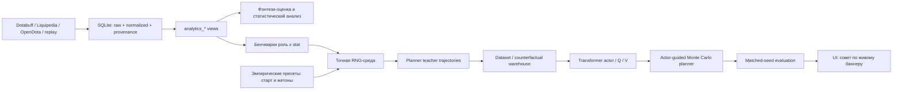
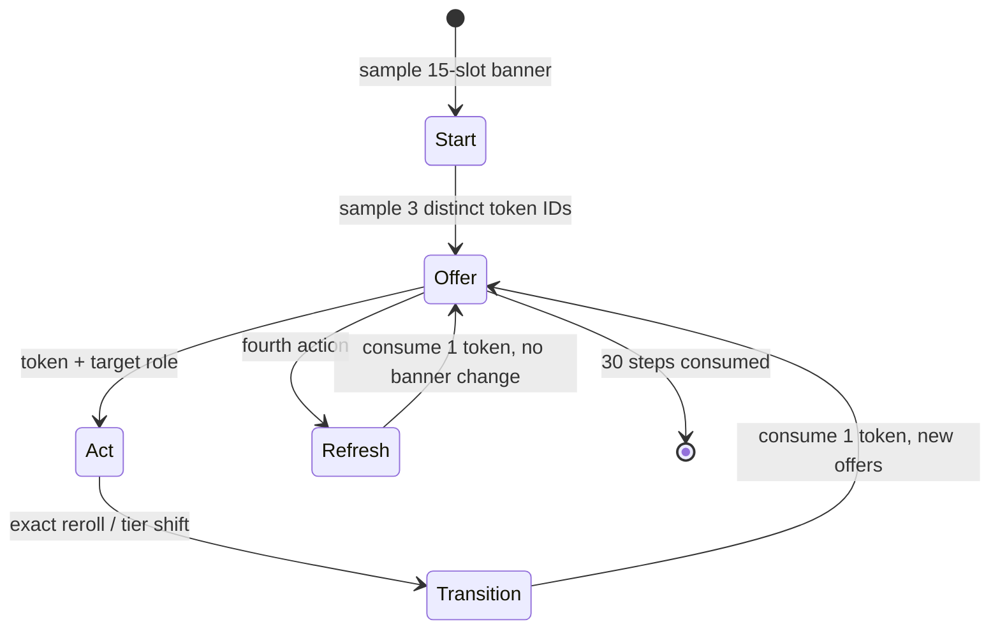

# Исследовательская архитектура

## Назначение

Проект объединяет два связанных, но независимых исследовательских контура.

1. **Tournament analytics** хранит проверяемую статистику EWC 2026 и TI 2026,
   пересчитывает фэнтези-вклад и строит описательные/предиктивные поверхности.
2. **RNG banner optimization** моделирует 30 последовательных замен эмблем и
   учится выбирать жетон, роль и момент `refresh` в симуляторе правил клиента.

Они используют общие фэнтези-правила и статистические бенчмарки, но не
смешивают реальные матчи с синтетическими RL-траекториями. Поэтому результаты
RNG-обучения нельзя интерпретировать как прогноз силы игроков, а TI-матчи не
являются supervised-датасетом для поведения в меню замен.

## Карта системы



## Данные и причинность

### Уровни данных

| Уровень | Единица | Назначение | Примеры |
|---|---|---|---|
| Raw | ответ API / replay event | воспроизводимость и provenance | OpenDota JSON, replay-derived метрики |
| Normalized | игрок x карта x stat | единая схема значений | kills, GPM, teamfight, wards |
| Fantasy | игрок x карта x stat | базовый и эмблемный вклад | base points, multiplier, total points |
| Role slot | команда x карта x role group | клиентские роли | `core_pair`, `mid_single`, `support_pair` |
| RNG state | 15 эмблем + остаток ходов | состояние MDP | stat, tier, trait, effective multiplier |
| Decision | состояние x набор офферов | выбор из трёх жетонов и refresh | token, role target, outcome |

### Важные границы достоверности

- Любая нулевая метрика интерпретируется только совместно с `coverage` и
  `source/provenance`: ноль может означать настоящий ноль или отсутствие
  источника.
- `watchers_taken` и `lotus` требуют особенно осторожной трактовки, так как
  открытые API могут измерять не клиентский счётчик.
- `tormentor_kills` в компактной базе является ролевым team-level estimate, а
  не доказанным last hit игрока.
- Ученик RNG видит синтетическое распределение стартов и жетонов. Его качество
  валидируется на новых общих seed-ах, а не по accuracy на обучающих строках.

## Фэнтези-объектив

Для одной эмблемы итог строится из базовых очков статистики и её эффективного
бонуса:

```text
slot_points = base_stat_points * (1 + effective_emblem_bonus / 100)
banner_value = aggregate(slot_points, role benchmarks, objective mode)
```

`effective_emblem_bonus` включает tier и trait. Trait не является независимым
аддитивным числом: он может зависеть от соседей и всего баннера. Например,
`Unique` активен только если в пределах роли это единственный Unique,
`Vampiric` усиливает себя и уменьшает соседние бонусы, `Benevolent` усиливает
соседей, `Fractal` зависит от разнообразия tier, `Friendly` -- от размера
набора Friendly. Реализация: `src/fantasy_roll_objective.py`.

Итоговая ценность окружения имеет режим риска:

| Режим | Utility в rollout-выборке | Практический смысл |
|---|---|---|
| `safe` | p25 | избегать хрупких замен |
| `balanced` | mean | нейтральная ожидаемая ценность |
| `ceiling` | p90 | искать высокий потенциальный потолок |

Это не прогноз официального итогового места и не замена формуле клиента. Это
внутренняя utility для сравнения возможных баннеров при фиксированных правилах
и распределениях.

## MDP для системы замен

Один эпизод содержит максимум 30 ходов. На каждом шаге сначала появляются три
жетона, затем выбирается одна легальная цель роли или `refresh`; после хода
набор жетонов генерируется заново.



Состояние `s_t` включает 15 эмблем и пять числовых признаков:

- `state_banner_value`;
- `state_rolls_left`;
- `state_progress_ratio`;
- флаги цели `safe` и `ceiling`.

Каждая из 15 эмблем содержит категориальные поля
`role_scope`, `slot_index`, `color_group`, `stat_name`, `quality_tier`,
`trait_name` и числовой `multiplier`. Действие -- один из legal
`token x target role` плюс `refresh`; действительное число legal actions
варьируется, поэтому используется mask.

## Нейросетевая архитектура

Рабочая реализация: `SlotAwareActorCritic` в
`src/fantasy_rng_slot_neural.py`. Параметры по умолчанию: embedding `16`,
hidden size `128`, два Transformer encoder layers, четыре attention heads,
FFN size `256`, dropout `0.1`.

```mermaid
flowchart TB
    S[15 slots x 6 categorical fields] --> SE[6 embedding tables, 16d each]
    M[effective multiplier] --> SP
    SE --> SP[slot projection: 97 -> 128]
    SP --> T[2x Transformer encoder\n4 heads, FFN 256]
    T --> POOL[mean pool over 15 slots]
    N[5 state numeric features] --> ST
    POOL --> ST[state MLP: 133 -> 128 -> ReLU]
    A[variable actions x 5 categorical fields] --> AE[5 embedding tables, 16d each]
    AN[4 action numeric features] --> AP
    AE --> AP[action MLP: 84 -> 128 -> ReLU]
    ST --> CAT[concat state and action: 256]
    AP --> CAT
    CAT --> ACT[actor logit per action]
    CAT --> Q[Q(s,a) head]
    ST --> V[V(s) head, clamp -8..8]
```

Числовые признаки действия: текущий multiplier цели и предварительно
вычисленные `expected_delta`, `p75_delta`, `p90_delta`. Они не дают модели
готового решения: сеть сопоставляет их с конкретной конфигурацией 15 слотов,
цветом, role target и оставшимися ходами.

### Heads

- **Actor head** возвращает logit для каждого legal action и задаёт
  `pi_theta(a | s)`.
- **Q head** оценивает action-specific ценность `Q(s,a)`.
- **V head** оценивает ценность состояния. Его output ограничен в
  нормализованном пространстве, чтобы ранний training не раздувался от
  крупного raw `banner_value`.

Имеется экспериментальный `SlotAwareCrossAttentionRanker`: у каждого action
есть query к 15 slot keys. Он полезен как исследовательская альтернатива для
сильнее адресного выбора, но не является активной UI-моделью без promotion по
matched evaluation.

## Обучение

### Teacher / imitation corpus

Точный simulator и rollout planner порождают полные 30-step trajectories.
Для каждого decision warehouse сохраняет состояние, все legal actions,
поведение planner-а, actor probabilities и итоговую utility. Это позволяет
обучать model на одних и тех же правилах без ручной разметки.

Bootstrap-loss:

```text
L = CE(actor_logits, argmax q_target)
  + 0.5 * MSE(Q(s,a), zscore(q_target))
  + 0.25 * MSE(V(s), max_a zscore(q_target))
```

Разделение holdout проводится по `episode_index`, а не по строкам, чтобы
близкие решения одного 30-step run не оказались одновременно в train и test.

### PPO self-play fine-tuning

`src/fantasy_rng_slot_rl.py` использует on-policy PPO над точной средой:

```text
A_t = GAE(gamma=0.99, lambda=0.95)
L_PPO = -min(r_t A_t, clip(r_t, 0.85, 1.15) A_t)
        + 0.5 * Huber(V(s_t), return_t)
        - 0.01 * entropy(pi)
```

В одной update берутся эпизоды всех трёх risk modes по кругу. Для стабильности
возможны два консервативных дополнения:

- behaviour cloning к teacher labels (`bc_weight`);
- KL-якорь к baseline actor (`anchor_kl_weight`).

PPO обновляет именно actor и V path. В UI действие по-прежнему выбирает не
голый actor, а planner, поэтому promotion обязана проверять составную систему.

### Conservative offline actor-critic

`src/fantasy_rng_offline_policy.py` -- диагностический offline-RL слой:
weighted cross-entropy к planner choice + KL к распределению behavior +
Smooth L1 для selected `Q(s,a)` и лёгкий target для `V(s)`. Его stage-2
checkpoint не прошёл independent evaluation и не используется в UI. Это важный
контрпример: низкий train loss или высокий imitation top-1 не доказывают
улучшение конечной 30-step policy.

## Planner и decision rule

```mermaid
sequenceDiagram
    participant Env as Exact environment
    participant Actor as Transformer actor
    participant Planner as MC planner
    Env->>Actor: state + all legal actions
    Actor->>Planner: ranked logits
    Planner->>Planner: retain best role for each token + Refresh
    loop candidate x rollout
        Planner->>Env: clone state, apply candidate
        Planner->>Actor: greedy future actions for bounded horizon
        Planner->>Env: exact transitions and value
    end
    Planner->>Planner: mean / p25 / p90 by risk mode
    Planner-->>Env: choose maximum utility action
```

По умолчанию planner использует top-k `3`, `8` rollouts и horizon до `8`.
`refresh` рассматривается явным четвёртым решением. Для каждого из трёх
предложенных token ID сначала определяется одна наиболее осмысленная legal
роль; это не позволяет одной роли незаметно вытеснить другой жетон из набора
кандидатов. Terminal critic может быть добавлен только как bounded leaf
bootstrap; в рабочем UI его вес `0.0`.

## Валидность и promotion gate

Главный эксперимент -- paired / matched comparison. Baseline и кандидат
получают одинаковые start states, token offers, stochastic outcomes и risk
mode. Для каждого эпизода считается:

```text
delta_i = final_value(candidate, shared_seed_i)
        - final_value(baseline, shared_seed_i)
```

В отчёте нужны mean delta, median, win rate и bootstrap 95% CI. Кандидат не
становится активным по положительному train metric. Минимальное правило:
нижняя граница доверительного интервала должна быть неотрицательной на свежих
seeds, а safe scenario не должен иметь существенной регрессии.

## Текущий operational статус

| Слой | Статус | Где используется |
|---|---|---|
| Exact environment + scoring | active | симуляция, planner, UI |
| `rng_neural_slot_selfplay_selected_v1.pt` | active baseline | UI candidate proposer |
| Actor-guided MC planner | active | окончательный выбор в UI |
| Strategy prior | tie-break / configurable | planner research runs |
| terminal critic stage 2 | rejected | только диагностика |
| cross-attention ranker | experimental | не UI default |

Активная модель и UI-convention зафиксированы также в `HANDOFF_RNG_RL.md`.
Перед сменой checkpoint требуется новый matched evaluation, а не только
обновление файла в `models/`.
